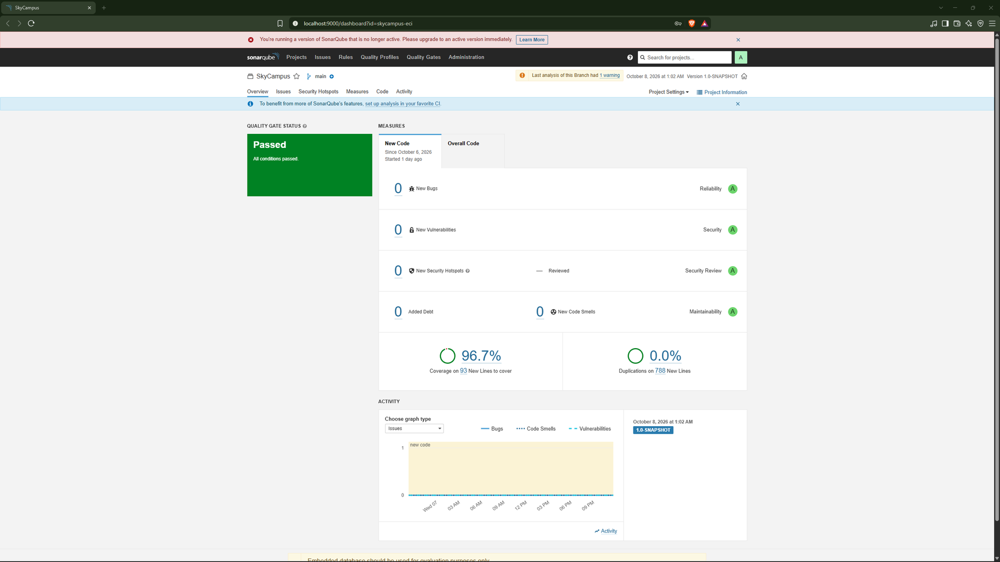

# Reto 13 Monferno - Quality Gate de v2

## JaCoCo

Regla en `pom.xml`: línea ≥ 80%, rama ≥ 70% (falla el build si no se cumple).

| Métrica | Resultado |
| --- | --- |
| Line coverage | 98.9% |
| Branch coverage | 92.2% |

## SonarQube

El código de Monferno no introdujo ningún issue nuevo: ya partía limpio desde las correcciones del reto 14 de Chimchar (`docs/calidad.md`).

| Métrica | Resultado |
| --- | --- |
| Bugs | 0 |
| Vulnerabilidades | 0 |
| Deuda técnica añadida | 0 min (objetivo: < 30 min) |
| Quality Gate | Passed |

