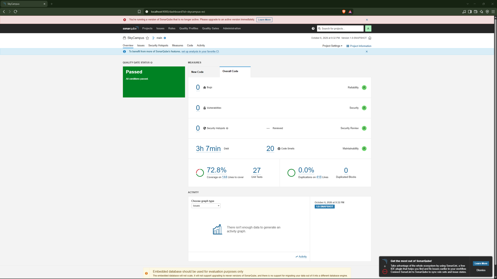
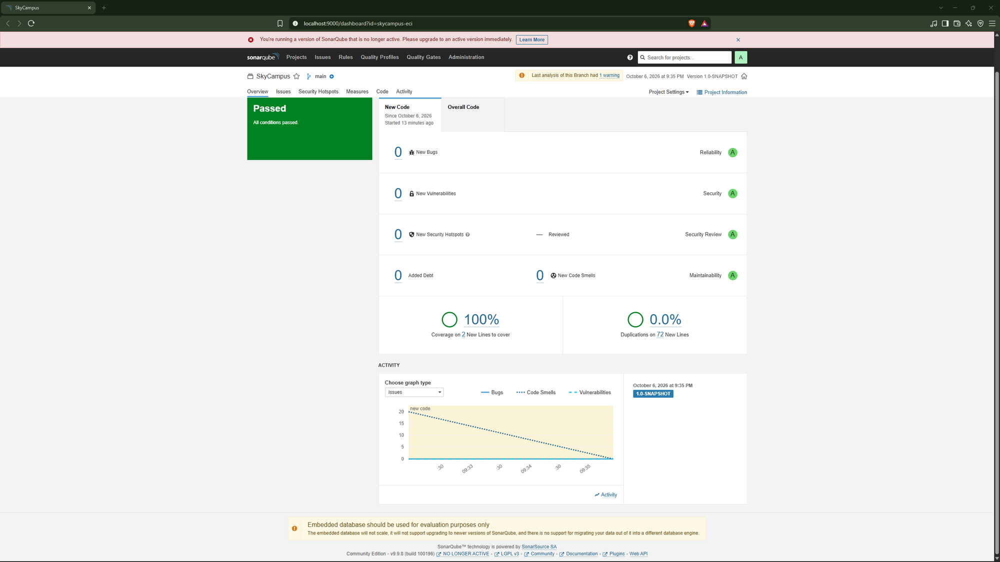

# Retos 13 y 14 - JaCoCo y SonarQube

## JaCoCo

- Cobertura de líneas: **100%** (mínimo exigido en el `pom.xml`: 80%).
- Cobertura de ramas: **91.7%**.
- 27 pruebas; las clases `Main` se excluyen por ser demos.

## SonarQube

| Métrica | Antes | Después |
| --- | --- | --- |
| Calificación | A | A |
| Bugs | 0 | 0 |
| Vulnerabilities | 0 | 0 |
| Code Smells | 20 | 0 |
| Deuda técnica | 3h 7min | 0 |

### Antes

### Code smells corregidos

| Code smell | Cantidad | Corrección |
| --- | --- | --- |
| Uso de `System.out` | 12 | Reemplazado por `Logger`. |
| Literales duplicados | 7 | Extraídos a constantes. |
| Constructor público implícito en `ConsultasFlota` | 1 | Constructor privado. |

### Después

