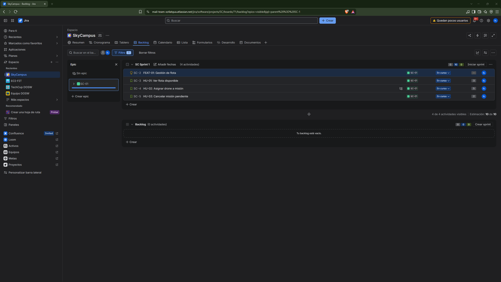
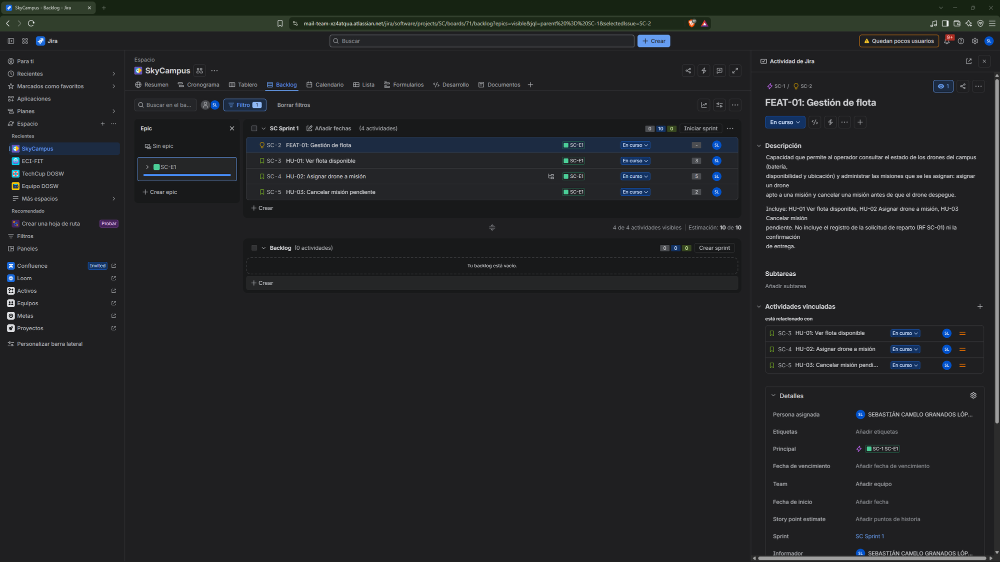
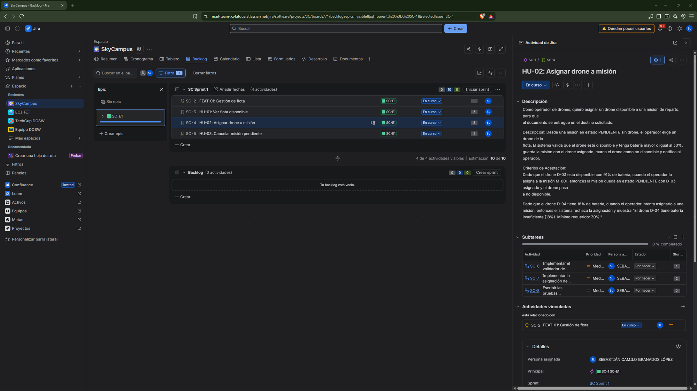

# Reto 09 - Agilismo y Jira (Chimchar)

Backlog del SkyCampus MVP en Jira: épica **SC-E1**, feature **FEAT-01: Gestión de flota** y las historias **HU-01, HU-02 y HU-03**, todas como hijas de la épica y vinculadas al feature con "relates to". Las subtareas cuelgan de HU-02.

## 1. Backlog del sprint

Backlog filtrado por la épica SC-E1 con el **SC Sprint 1**: el feature FEAT-01 y las 3 historias de usuario (ver flota, asignar drone, cancelar misión) con sus Story Points (3 + 5 + 2) y en estado **En curso**.

## 2. Feature FEAT-01: Gestión de flota

FEAT-01 abierto: descripción con el alcance del feature (qué incluye y qué no), la épica SC-E1 como principal y, en **Actividades vinculadas**, las 3 historias relacionadas (HU-01, HU-02 y HU-03).

## 3. Historia HU-02: Asignar drone a misión

HU-02 abierta: historia en formato **Como… quiero… para…**, descripción del comportamiento, **2 criterios de aceptación** Dado/Cuando/Entonces (asignación exitosa y rechazo por batería < 30%) y las **3 subtareas** técnicas: validador de batería mínima, asignación del drone a la misión y pruebas unitarias. Está vinculada a FEAT-01.
