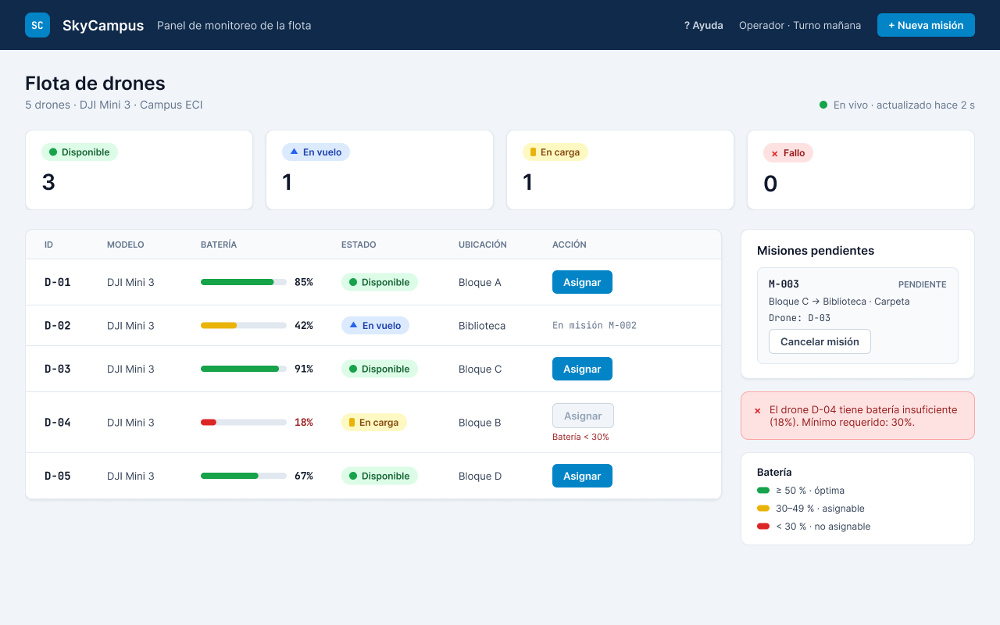

# Reto 08 - Manual de identidad y UX/UI

## Paleta

| Rol | Hex |
| --- | --- |
| Primario (azul noche) | `#0F2A4A` |
| Secundario (gris pizarra) | `#334155` |
| Acento (cian) | `#0284C7` |
| Fondo | `#F1F5F9` |
| Texto | `#0F172A` |

El azul noche y el gris pizarra transmiten control y confianza; el cian se reserva para la acción principal.

## Colores de estado

| Estado | Color | Ícono |
| --- | --- | --- |
| Disponible | `#16A34A` | ● |
| En vuelo | `#2563EB` | ▲ |
| En carga | `#EAB308` | ▮ |
| Fallo | `#DC2626` | ✕ |

Cada estado se muestra con color, ícono y texto.

## Tipografía

- **Inter** (400 y 600) para la interfaz.
- **JetBrains Mono** para IDs de drone y códigos de misión.

## Tono de voz

Técnico y directo: "El drone D-04 tiene batería insuficiente (18%). Mínimo requerido: 30%."

## Mock del panel de monitoreo

[Ver en Figma](https://www.figma.com/design/OU9BxTSHijhHnXzWRVI6s3)

## Heurísticas de Nielsen que cumple

| # | Heurística | Cómo |
| --- | --- | --- |
| 1 | Visibilidad del estado | Estado y batería de cada drone visibles sin clics. |
| 3 | Control del usuario | Botón "Cancelar misión" en misiones pendientes. |
| 4 | Consistencia | Mismos colores e íconos de estado en todo el panel. |
| 5 | Prevención de errores | "Asignar" deshabilitado en drones con batería < 30%. |
| 6 | Reconocer antes que recordar | Leyenda de batería y misión actual de cada drone. |
| 8 | Diseño minimalista | Solo ID, modelo, batería, estado, ubicación y acción. |
| 9 | Mensajes de error claros | El error indica el drone, su batería y el mínimo requerido. |
