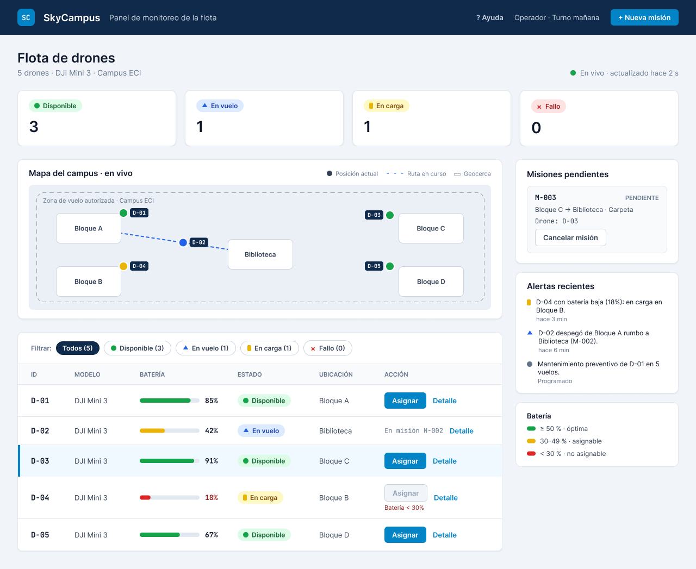
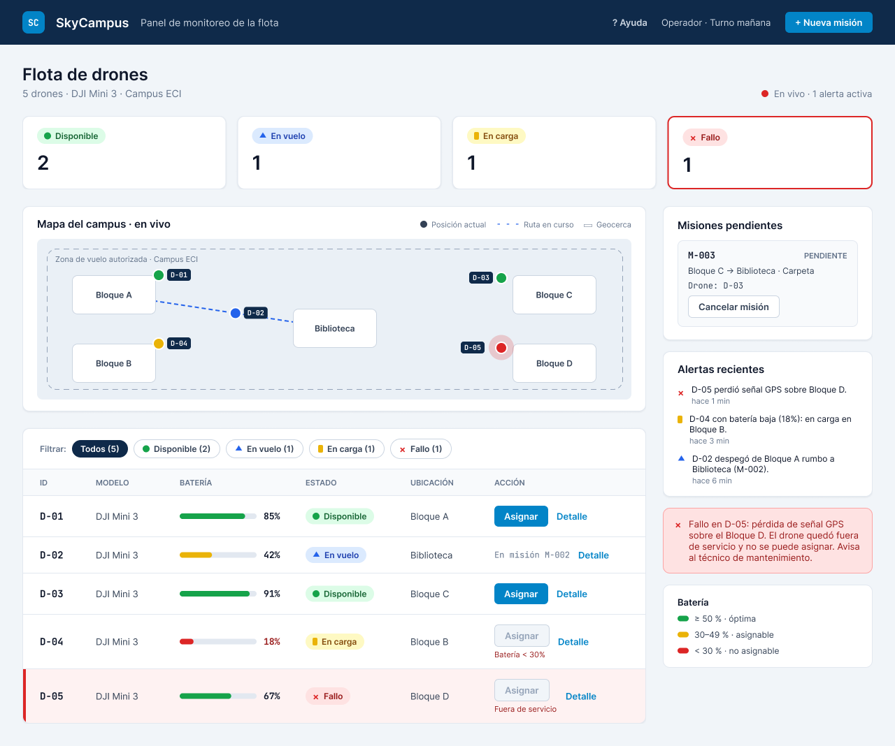
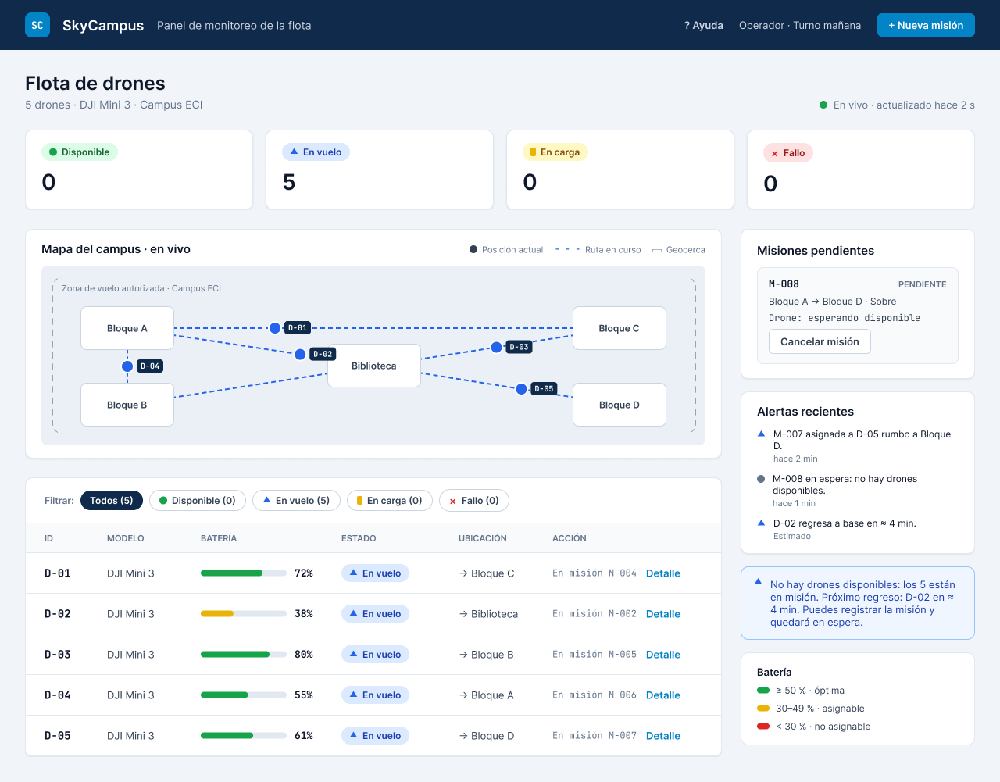

# Reto 11 - Mocks con IA

[Ver en Figma](https://www.figma.com/design/OU9BxTSHijhHnXzWRVI6s3)

## Referencias

- [Axxon - Rastreo GPS](https://get.axxon.co/es/rastreo-gps): mapa en vivo, geocercas y alertas en tiempo real.
- [Alfred - Flotas Pro](https://alfred.co/flotas-pro): indicadores de la flota y alertas preventivas de mantenimiento.

## Prompt

```text
Actúa como diseñador UX/UI senior de sistemas de control.
SISTEMA: SkyCampus — Panel de control de flota de drones ECI
PANTALLA: Panel de monitoreo de la flota (vista principal del operador)
ESTILO: azul noche #0F2A4A, gris pizarra #334155, acento cian #0284C7, fondo claro #F1F5F9.
  Tipografía Inter y JetBrains Mono para IDs. Estados: Disponible #16A34A, En vuelo #2563EB,
  En carga #EAB308, Fallo #DC2626, cada uno con ícono + texto.
ACTOR: Operador de drones — necesita tomar decisiones rápidas
DATOS POR DRONE: ID (D-XX), batería en %, estado, ubicación actual
ACCIONES: Seleccionar drone, Asignar a misión, Ver detalle, Filtrar por estado
REFERENCIAS: mapa en vivo con geocerca y alertas (Axxon); indicadores y alertas de
  mantenimiento (Alfred)
ESTADOS:
  1. Normal: flota con drones en distintos estados
  2. Alerta: un drone en estado FALLO (destacado visualmente)
  3. Vacío: todos los drones en misión simultáneamente
Nielsen: visibilidad del estado (#1), minimalismo (#8), prevención de errores (#5)
```

## Estado 1 · Normal



Nielsen: #1 (estados, mapa y contadores visibles), #5 ("Asignar" deshabilitado en D-04), #6 (mapa y filtros), #8 (solo datos necesarios).

## Estado 2 · Alerta



Nielsen: #1 (fallo de D-05 visible en tabla, mapa, contador y alertas), #5 (D-05 no asignable), #9 (mensaje con causa y acción).

## Estado 3 · Vacío



Nielsen: #1 (5 drones en vuelo con sus rutas), #3 (cancelar la misión en espera), #8 (un solo mensaje explica la situación).
