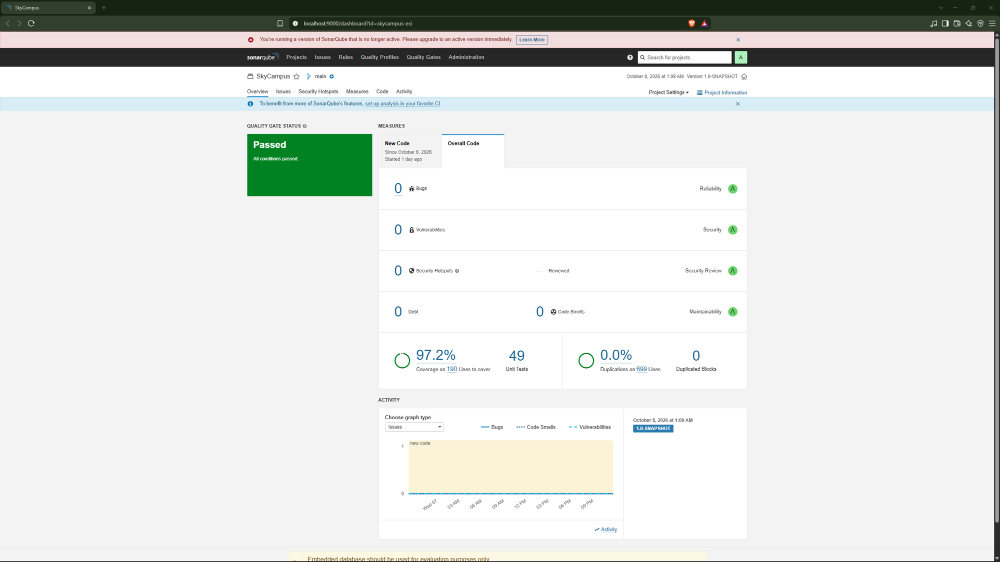

# Reto 14 Monferno - SonarQube de la v2 completa

Análisis sobre todo el proyecto (Chimchar + Monferno), incluidos los paquetes de Strategy (`v2/asignacion`) y Observer (`v2/observer`).

| Métrica | Resultado | Objetivo del reto |
| --- | --- | --- |
| Quality Gate | Passed | Verde |
| Bugs | 0 | 0 |
| Vulnerabilidades | 0 | 0 |
| Code Smells | 0 | 0 (incluye Strategy/Observer) |
| Deuda técnica | 0 min | ≤ 30 min |
| Cobertura | 97.2% (49 pruebas) | ≥ 85% |
| Duplicación | 0.0% | — |

Los code smells de la mayor complejidad introducida por Strategy y Observer (más clases, más interfaces) quedan en 0: no se detectó duplicación entre las 3 estrategias ni entre los 3 observadores.
